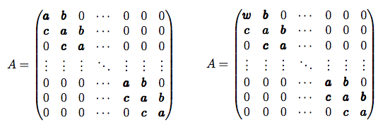

# Tridiagonal Toeplitz and Tridiagonal _near-_Toeplitz Matrices

Last year I got interested in a particular kind of one-dimensional problem involving multiple point masses oscillating as if they were connected by springs. The problem of finding the normal modes of such a system reduces to diagonalizing a matrix of a special form, known as a [_Tridiagonal Toeplitz_](http://de.wikipedia.org/wiki/Tridiagonal-Toeplitz-Matrix) matrix. Not content with just looking up their eigenvalues, I decided to prove the result myself.

Almost a year later, a follow-up to that problem involved a small change to the physical system that propagated itself as a small change in the problem's tridiagonal Toeplitz matrix. As a result, the eigenvalues from the original problem no longer applied and I had to solve a whole new problem: finding the eigenvalues and eigenvectors of a tridiagonal matrix that is _almost_ Toeplitz (with a sensible definition of _almost_).

To my knowledge, this is an original result.

The matrix on the left is a _pure_ tridiagonal Toeplitz matrix. The one on the right is a tridiagonal _nearly-_Toeplitz matrix. Note the change from **a** to **w** in position (1,1).

Originally written on April 6, 2014 and January 30, 2015.

## Creator

That would be me, _Wagner Truppel_. If you need or want to contact me, send a message to `wagner` at `restlessbrain` dot com.

## License

I'm sharing this work under the [Creative Commons Attribution-ShareAlike 4.0 International (CC BY-SA 4.0)](http://creativecommons.org/licenses/by-sa/4.0/) license. See the LICENSE file for more information.
